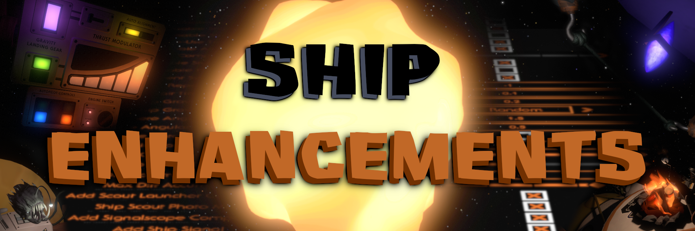

---

Ship Enhancements adds way too much stuff to the ship, all of which you can find in the mod settings menu. Any changes to the ship will be applied on the next loop. Experiment and have fun!

---

To answer some questions you may have...

## Is this mod compatible with [Quantum Space Buddies](https://outerwildsmods.com/mods/quantumspacebuddies/)?
Yep! Whoever hosts the game will have control over the settings.

## How am I supposed to carry all of these new items?
I made a mod called [Traveler's Pack](https://outerwildsmods.com/mods/travelerspack/) to address this problem. Try playing with it enabled if you run into the issue of there being too many items.

## Does this mod support [Achievements+](https://outerwildsmods.com/mods/achievements/)?
It sure does! It adds 12 new achievements that you can try and unlock.

---

# Feature Overview

## Disable Ship Parts
Permanently remove useless or very important parts of the ship.

### *Components*
- **Gravity Crystal**: You are now only affected by outside sources of gravity. If you're in space you'll just float.
- **Headlights**: Disables your ship's headlights and landing camera light. You may need to rely on your scout for light.
- **Landing Camera**: Good luck.
- **Oxygen**: Literally removes all of the oxygen in the ship unless you're near trees or in an oxygen-filled atmosphere. This takes priority over all of the other oxygen modifications.
- **Interior/Exterior Lights**: Makes your ship very dark.
- **Ship Scout Recall**: Removes your ability to recall the scout using the ship. The scout must be manually docked on the ship's scout launcher to fire, and can only be recalled using the handheld scout launcher.
- **Ship Scout Launching**: Removes your ability to launch the scout from the ship. You'll have to do this yourself outside of the ship.
- **Handheld Scout Recall**: Removes your abillity to recall the scout on foot. If you shoot your scout somewhere, you'll have to walk over and pick it up by hand to use it again. If you accidentally launch it into deep space, don't worry; if the ship can still recall it, you can go retrieve it from the top of the ship in the scout launcher.
- **Thrusters**: Lets you turn off your backward, horizontal, or vertical thrusters, or all of them except the forward thrusters if you really want a challenge.

### *Utility*
- **Damage Indicators**: Turns off all of those pesky notifications about parts of your ship being damaged, including the master alarm. Keep an eye or four on the reactor, please.
- **Eject Button**: Covers the eject button with tape so that your friend can't keep ejecting the cockpit while you're trying to fly.
- **Seatbelt**: Breaks a number of state laws by removing your seatbelt. If you crash into something with enough force you'll fly out of the chair.
- **Ship Suit**: Removes your spacesuit from the ship. Space exploration just got a whole lot more dangerous.
- **Medkit**: Prevents you from healing inside the ship. Marshmallows might end up being your only way to regain health.
- **Hatch**: Removes the hatch, leaving a gaping hole in your ship. Be careful when you're walking around in there!
- **Single-Use Tractor Beam**: Turns off the ship's tractor beam after you enter the ship for the first time. If you leave without your suit, you might have trouble getting back in again.

### *Environmental*
- **Air/Water Auto Roll**: Lets you fly around upside down in air and water, which is really confusing when paired with no ship gravity. Also makes it easier to land on walls, if you wanted to do that.
- **Fluid Prevention**: Makes it possible for fluids to enter your ship. Make sure your suit is on before you start flying around underwater.
- **Hazard Prevention**: Makes it possible for outside hazards to injure you inside the ship. Don't fly too close to the sun!

### *Navigation*
- **Lock-on**: Removes your ability to lock on to objects. No autopilot, no distances, and no way of knowing how fast you're going.
- **HUD Markers**: Hides the on-screen markers that tell you the location of your ship, your scout, and any marked ship log locations. Ship log locations inside The Stranger are left visible until you arrive.
- **Minimap Markers**: Hides the icons on the minimap globe that tell you the location of your ship, your scout, and yourself.

## Adjust Ship Functions
Change some of the ways the ship works to make gameplay easier, harder, or just more chaotic.

### *Ship Resource Drain*
- **Oxygen Drain Multiplier**: Larger numbers make your ship's oxygen drain faster.
- **Fuel Drain Multiplier**: Larger numbers make your ship's fuel drain faster.
- **Oxygen Tank Drain Multiplier**: Larger numbers increase the amount of oxygen that drains when the ship's oxygen tank is damaged.
- **Fuel Tank Drain Multiplier**: Larger numbers increase the amount of fuel that drains when the ship's fuel tank is damaged.
- **Idle Fuel Consumption Multiplier**: Larger numbers increase how quickly your fuel drains over time. If the **Engine Switch** is enabled, it will not drain fuel while the ship is off.
- **Jetpack Refuel Drain**: Drains the ship's fuel reserve when you refuel your jetpack. You cannot duplicate fuel by transferring it back into the ship.

### *Ship Damage*
- **Damage Multiplier**: Larger numbers increase the damage done to the ship hull and increase the probability that components will be damaged on impact.
- **Damage Speed Multiplier**: Larger numbers increase the speed you need to be traveling at before taking damage. Set this to something really small to blow up your ship when you touch something.
- **Random Hull Damage**: Applies random damage to a random set of hulls on the start of the loop. The slider controls the percentage of hulls to be damaged- minimum is none, maximum is all of them- and how much damage to do to them.
- **Random Component Damage**: Breaks a set number of random components at the start of the loop. The silder controls the percentage of components to be damaged, where the minimum is none and the maximum is all of them. The vital ship components (reactor, fuel tank, one random thruster) are excluded from being selected.
- **Enable Stun Damage**: Blocks all of your inputs for a short time after you crash. The harder you hit something, the longer you'll be frozen.
- **Enable Fragile Ship**: Prevents you from moving your ship if the ship is damaged at all.
- **Prevent System Failure**: Keeps your ship up and running as long as the cockpit is still attached.
- **Ship Water Damage**: Determines how much damage your ship should sustain while submerged in water. Max damage will instantly blow up your ship.
- **Ship Sand Damage**: Determines how much damage your ship should sustain while being bombarded by falling sand. Max damage will instantly blow up your ship.
- **Repair Limit**: Sets a limit on how many parts you can repair before ship repair is completely disabled.
- **Repair Time Multiplier**: Larger numbers increase the time it takes to repair parts of your ship.

### *Ship Physics*
- **Atmosphere/Space Angular Drag Multiplier**: Larger numbers make it harder to turn your ship. Setting this to 0 lets you spin your ship forever.
- **Disable Rotation Speed Limit**: Lets you spin your ship as quickly as you want. Enabling this may quickly lead to motion sickness.
- **Air Drag Multiplier**: Larger numbers make atmospheres slow you down more. Setting this to 0 lets your ship drift endlessly through the air.
- **Cyclone Chaos**: Determines how violently cyclones should affect your ship.
- **Ship Friction**: Lets you adjust how much friction to apply to the ship.
- **Ship Bounciness**: Larger numbers increase the bounciness of the ship. Values above 1 will be less accurate and will no longer affect players.

### *Ship Components*
- **Ship Gravity Multiplier**: Larger numbers increase the strength of your ship's gravity crystal. Large numbers are advised against, however, as exiting your ship will kill you.
- **Ship Gravity Direction**: Lets you change the direction of your ship's gravity. Set this to Random if you feel like the game isn't painful enough.
- **Reactor Lifetime Multiplier**: Larger numbers increase the time it takes for the reactor to blow up when it has been damaged. Set this to something small to give yourself a panic attack every time the master alarm goes off.
- **Ship Explosion Multiplier**: Larger numbers increase the size of the explosion that is created when your ship blows up. Don't go above 30.
- **Extra Explosion Damage**: Gives explosions the ability to damage your ship and fragments of Brittle Hollow. Also lets you kill anglerfish.
- **Keep Power On**: Prevents the lights and other electrical parts from turning off when you leave the ship.

### *Miscellaneous*
- **Prolong Digestion**: Lets you survive for a short period of time while your ship is being digested.
- **Ship Noise Multiplier**: Larger numbers increase the distance your ship can be detected by noise detectors.
- **Extra Noise**: Makes noisy parts of the ship, like the master alarm, alert noise detectors.
- **Ship Input Latency**: This basically simulates internet lag, where larger numbers increase the time it takes for the ship to process your inputs. A value of 1 means it takes 1 second for your "upwards thrust" input to register.
- **Funny Sounds**: Replaces some of the in-game sounds with silly sound effects.

## Add Ship Features
Some new stuff that Slate didn't have time to include in the ship.

### *Utility*
- **Oxygen Refill**: Refills the ship's oxygen tank when it gets close to trees or enters an oxygen-filled atmosphere.
- **Oxygen Refill Multiplier**: Larger numbers increase the speed at which your ship's oxygen tank refills when near an oxygen source.
- **Fuel Transfer**: Lets you transfer your jetpack fuel to the ship's fuel tank to refill it.
- **Fuel Transfer Multiplier**: Larger numbers increase the speed of fuel transfers. You will transfer fuel to the ship faster, but refueling will drain the ship faster too (if refuel drain is enabled).
- **Automatic Hatch**: Automatically closes the hatch when you leave the ship. **Quantum Space Buddies** has this feature by default.
- **Interactable Ship Curtain**: Lets you close the curtain inside the ship, blocking off the cockpit.
- **Clock**: Adds a clock to the cockpit that tells the time in minutes and seconds. It makes a nice ticking sound, if you like that sort of background noise.

### *Components*
- **Scout Launcher Component**: Turns the ship's scout launcher into a fully functioning ship component. If you damage it, you won't be able to launch or recall your scout from the ship until you repair it.
- **Ship Scout Photo Mode**: Lets you switch to photo mode on the ship's scout launcher. It will default to photo mode if scout launching is disabled.
- **Signalscope Component**: Turns the ship's signalscope into a fully functioning ship component. If you damage it, you won't be able to receive or broadcast signals from the ship until you repair it.
- **Ship Signal**: Adds a signal for the ship on the Outer Wilds Ventures frequency. The signal will stop if the ship's signalscope is damaged. Slate also said they added a "command transmitter" to your signalscope, whatever that means.

### *Items*
- **Portable Campfire**: Adds a portable campfire to the ship next to your suit. Set it up wherever you want and roast a marshmallow.
- **Portable Tractor Beam**: Adds a portable Nomai tractor beam to the ship near the ship log. Place it down somewhere if you need an extra boost in height.
- **Portable Fuel Canister**: Adds a portable fuel tank inside the ship at the back. You can bring it around with you in case you need to refuel your jetpack while traveling. The fuel tank can completely refill your jetpack about 3 times before it runs out of fuel.
- **Repair Wrench**: Adds a repair wrench to the cockpit.
  - "Enabled" speeds up your repairs while you're holding the wrench, and "Required" doesn't let you make repairs unless you're holding the wrench.
- **Expedition Flag**: Adds a portable flag to the ship between the cockpit and the supplies section. Placing it down will add a flag marker to your minimap.
  - You can add custom images to the **Expedition Flag**! If that sounds interesting, navigate to this mod's folder using the mod manager and open the folder named "ExpeditionFlagIcons".
- **Radio**: Adds a radio to the cockpit. You can tune in to radio stations by inputting a 4-digit code. Slate posted the codes for a few of the classics on the wall behind the radio.
- **Ship Tether**: Adds a few hooks to the ship cabin. You can attach these hooks to pretty much any surface- including the ship- and tether yourself to them. If you want to get even crazier, grab a second hook after tethering to one and tether to the new one; it will connect the two hooks together.
- **Resource Pump**: Adds a wireless pump to the back of your ship that can transport resources to and from your ship. Some tips on how to use it:
  - Each resource mode has an input mod and an output mode. Input will transport the resource to your ship, and output will fire that resource out of the pump.
  - Setting oxygen mode to output will drain your ship's oxygen to make the area around the pump breathable. To fill your ship's oxygen, you can place the pump down in an oxygenated zone.
  - Setting fuel mode to output will turn the pump into a miniature thruster, which can push things around. To fill your ship's fuel, place the pump down near a fuel source (not the **Portable Fuel Canister**).
  - Setting water mode to output will drain water to turn the pump into a geyser, which acts as any other geyser. To fill your ship's water, place the pump inside a source of water. (Requires **Use Water Tank** to be enabled)
  - If the pump is too far from the ship (indicated by the WiFi icon), it will not work.
- **Removable Gravity Crystal**: Lets you detach the ship's gravity crystal and place it somewhere else to create a localized gravity field. The removed gravity crystal will have the same strength as it did in the ship.
- **Ship Item Placement**: Lets you place items inside or on top of your ship.
- **Unlimited Items**: Lets you duplicate items inside the ship. This only works on the items added by this mod.

### *Buttons*
- **Extra Eject Buttons**: Adds a few more eject buttons that all eject different parts of the ship.
- **Ship Warp Core**: Attaches a Nomai warp core to your ship's cockpit. You can press the button on the ceiling of the cockpit to activate the warp core, which will warp your ship back to where the ship was at the start of the loop.
  - The component option for this setting turns the warp core into a damageable component. Activating the return warp while it's damaged may have unintended results.
- **Gravity Landing Gear**: Adds an interface to the cockpit that controls the new gravity technology built into your ship's landing gear. It will stop working if your landing gear is damaged.
  - The purple switch turns the gravity landing gear on/off.
  - The green switch inverts the gravity, pushing you away from surfaces instead of pulling you towards them.
- **Thrust Modulator**: Adds an interface to the cockpit that lets you lower or disproportionately raise the maximum thrust your ship can use. Stacks with the smooth thrust option from General Enhancements.
  - The orange buttons let you set a limit on your maximum thrust.
  - The two rectangular buttons to the left of the orange buttons control the overdrive. Press the green button to disable the safeties, then once the bottom button turns yellow, press it to activate the overdrive. Make sure you're buckled up before the overdrive activates.
- **Auto Align Controls**: Adds an interface to the cockpit that lets you automatically rotate your ship to face the current lock-on target.
  - The right button turns auto alignment on/off. Lock onto something to use the feature.
  - The left button controls how your ship faces towards the target. Turning it on rotates your ship so that the bottom faces the target, and turning it off rotates the ship so that the cockpit faces the target.
- **Autopilot Controls**: Adds an interface to the cockpit that lets you control the new features added to the ship's autopilot system.
  - The interface is divided into two sections: autopilot override (the left 2 buttons) and match velocity override (the right 3 buttons). The two buttons that are currently selected control what engaging autopilot or matching velocity will do.
    - The default keybinds for autopilot and match velocity will activate the selected mode.
  - The top left button (turquoise) activates the default autopilot function. It will fly towards the lock-on target.
  - The bottom left button (blue) activates orbital autopilot, which will find a stable orbit around the lock-on target or the planet you're currently on.
  - The center button (red) activates input hold, which will put the ship in recording mode. While in recording mode, give the ship a thrust input (up, down, left, etc.) and turn off recording mode while holding that input. Now you can let go of everything, and it will keep holding that thrust until you press the button again.
    - Don't forget that while the red button is lit up, the match velocity button will also activate it! It's a lot easier to use that than trying to press the tiny red button every time.
  - The top right button (orange) activates the default match velocity. It will match velocity with whatever your lock-on target is.
  - The bottom right button (dark orange) activates position hold. It will remain at whatever position you activate it at relative to the lock-on target.
    - If you fly above a tree and activate position hold, the ship will try to stay above the tree. If it gets knocked away by something, it'll fly back to where it was.
- **Engine Switch**: Controls your ship's power and engine. The switch needs to be turned on if you want to fly your ship.
  - If the **Idle Fuel Consumption Multiplier** is above 0, it will only consume fuel when the ship is on.

### *Temperature*
- **Enable Ship Temperature** Unlocks the settings below and implements a temperature mechanic for the ship, which uses the existing "TEMP" (temperature) dial and a new "SHIP TEMP" (ship temperature) dial.
  - Extreme temperatures, indicated by the flashing light on the TEMP dial, will cause your SHIP TEMP to change over time. As your SHIP TEMP approaches extreme temperatures, your ship will begin experiencing side effects:
    - On the hot side, your ship will take random damage over time and the outside of the ship will become dangerous to touch. Your reactor will also heat up, reducing the time before explosion if it were to get damaged, but as a byproduct your ship thrust will become more powerful. At higher temperature difficulties, the **Portable Fuel Tank** can also heat up and explode.
    - On the cold side, it's actually safe to leave your ship alone. However, your ship engine has a chance to stall for a short time when starting up, and has a chance to damage your ship while doing so. Your ship thrust is weaker, and your ship hull is more fragile, making it take damage even with gentler collisions. If your reactor starts heating up, the cockpit glass will freeze over, making it harder to see where you're going.
- **Temperature Zones**: Determines where temperature will increase/decrease. "All" adds a temperature zone anywhere that looks hot or cold.
- **Temperature Difficulty**: Makes the side effects listed above safer or more dangerous. Set this to the minimum to disable all of them.
- **Temperature Resistance Multiplier**: Larger numbers make the ship temperature change slower, giving you more time in extreme temperatures but requiring more time to recover.
- **Passive Temperature Gain**: Causes your ship to heat up or cool down over time, making some areas safer and other areas more dangerous.
- **Allow Reactor Overload**: Lets you interact with the ship's reactor to overload it, which prevents your ship from getting cold but heats the reactor up. The colder it is, the hotter the reactor will get.

---

Temperature zones are not only added to the vanilla solar system, but are also added to the mods listed below! If you think a mod is missing from the list, feel free to contact me (Etherpod) or make a GitHub issue about it. if I haven't given up on modding yet, I'll update Ship Enhancements to add temperature zones to your mod.
 - Axiom's Refuge
 - Christmas Story
 - Echo Hike
 - Evacuation
 - Heliostudy
 - Misfired Jump
 - On A Rail
 - The Stranger They Are
 - Unnamed Mystery

---

### *Water*
- **Use Water Tank**: Unlocks the settings below and adds water as a new resource to your ship. Other features will drain it to function.
- **Water Drain Multiplier**: Larger numbers make the ship's water drain faster.
- **Add Water Cooling**: Adds a lever next to the ship log that turns on water cooling, which will drain water to prevent your ship from getting hot (meant to be used along with ship temperature).

### *Miscellaneous*
- **Ship Horn**: Lets you honk by pressing the flashlight keybind while the ship's signalscope is equipped. You can pick from a variety of horn noises.
- **Hazardous Thrusters**: Makes your ship's thruster flames actually damage you. Try figuring out how to get near them in the first place.
- **Cockpit Rust Level**: Controls how much rust is applied to the ship cockpit. Moving the slider all the way to the right completely covers the cockpit in rust.
- **Dirt Accumulation Time**: Larger numbers increase the time (in seconds) it takes for dirt to build up on your cockpit glass, which you can wash off by finding a source of water (or something similar to water). Set this to 0 to disable it.
- **Max Dirt Accumulation**: Stops dirt from building up on your cockpit when it reaches a certain level.
- **Enable Gas Leak**: Not quite sure what this one does.
- **Ernesto**: Adds Ernesto to the cockpit. You can talk to him if you're bored.

## Decoration
Haven't you ever wished your ship had a little more color?
- **Ship Light Color**: Changes the color of the ship's interior and exterior lights from a wide variety of options. Set this to Divine at your own risk, for mere Hearthians were never meant to see creations blessed by a god.
- **Interior/Exterior Hull Color**: Select from a variety of colors to change the inside or outside color of your ship. Just don't pick Rainbow.
- **Ship Thruster Flame Color**: Changes the color of the ship's thruster flames as well as the color of the thruster indicator inside of the ship.
- **Damage Indicator Color**: Changes the color of the ship damage display, the master alarm, the reactor, and the damage indicator lights.

---

Enabling color blending lets you fade the ship decoration between different colors based on certain parameters. For example, I could set it to change the lights to red if the ship is hot and change the lights to blue if the ship is cold. If you want to try messing with it, here's an overview on the different parameter options:
- **Time**: Fades between colors over time.
- **Fuel**: Changes colors as your fuel gets lower.
- **Oxygen**: Changes colors as your oxygen gets lower.
- **Ship Damage %**: Sets the color based on how many ship parts are damaged.
- **Reactor State**: Sets the color based on the reactor's current state, whether it be undamaged, damaged, or about-to-explode.
- **Velocity**: Sets the color based on whether you're moving towards or away from your current lock-on target.
- **Gravity**: Changes colors as your ship experiences a stronger gravitational pull.
- **Temperature**: Changes colors as the environment becomes warmer or colder.
- **Ship Temperature**: Changes colors as your ship becomes warmer or colder.

---

## Quality of Life
Some bug fixes and some small things that make your ship a little nicer to use.
- **Repair Confirmation**: Plays a sound when everything has been repaired. Now you don't need to go searching for any ship components you forgot to fix!
- **Show Warning Notifications**: Notifies you in the ship when resources are low or when the outside conditions are becoming dangerous.
- **Buttons Require Flight Chair**: Makes it so buttons in the cockpit can only be pressed while you're piloting the ship. Useful if your friends keep messing with them while you're trying to fly.
- **Remember Ship State**: Preserves the current settings applied to the ship and the current state of the ship (resource levels, ship damage, etc.) when warping to a new star system. When you die, the settings will update and your ship will be reset.
  - For example: If you change a setting before warping, you won't see that change after you warp. If your fuel is half empty, your fuel will still be half empty after warping.
- **Always Allow Map Lock-on**: Lets you use the lock-on feature on the map while you're standing on a planet.
- **Split Ship Lock-on**: Separates your ship lock-on target and your suit lock-on target. If you lock onto something while piloting the ship, the ship will continue using that as the target if you exit the seat and lock onto something else.
  - For example: Standing outside the ship, you open your map and lock onto Brittle Hollow. If you start piloting the ship, you will no longer be locked onto Brittle Hollow, and you can lock onto something else. If you exit the flight chair, you will be locked onto Brittle Hollow again.
- **Keep Helmet On**: When there is no oxygen present, this prevents the game from removing your helmet when doing things such as piloting the ship or roasting a marshmallow at a campfire.

## Presets
In case there are too many settings to deal with, there are some pre-made presets for you to use. The settings can still be meddled with after choosing one.

- **Vanilla Plus** - Turns everything off except for the Quality of Life changes.
- **Minimal** - Disables anything that could be considered useful.
- **Impossible** - Makes it very difficult to keep your ship in one piece.
- **New Stuff** - Adds all the new stuff to your ship.
- **Pandemonium** - I just turned everything on for this one. Good luck.
- **Random** - Randomizes all of the options each loop. This preserves the settings you had selected previously, so just switch back to the **Custom** preset when you're done.
    - You can control the Random preset with two sliders: **Randomizer Iterations** and **Randomizer Difficulty**.
      - **Randomizer Iterations** controls how many of the settings to randomize each loop, ranging from only a handful of settings to nearly all of them.
      - **Randomizer Difficulty** controls how likely it is for difficult settings to be chosen. Minimum difficulty completely removes all of the difficult settings, like **Disable Ship Suit**.
    - You can also control the preset using the **RandomizerSettings.json** file in the mod folder, which lets you choose settings to include/exclude from the randomizer.

## API
To use the API, copy the **IShipEnhancements** script from this mod's GitHub repository into your own project, then follow [these instructions](https://owml.outerwildsmods.com/guides/apis.html#consuming-apis) on the OWML docs.

- **CreateTemperatureZone()** - In case you're a modder and want to add your own high/low temperature zones. Temperature zones can stack, and will just take the sum of the temperatures.
- **GetSettingsProperty()** - Returns the value of a config setting as seen from the player. These values only update at the beginning of the loop, so changing the mod settings doesn't affect them.
- **SetSettingsProperty()** - Lets you change the value of a config setting in the middle of the loop. Note that this change will be reverted on the next loop.
- **SetSettingsOptionVisible()** - Lets you set the visibility of a settings option in the mod settings menu. If an option is hidden, it cannot be changed by the user but can still be changed in code.
- **HideAllSettings()** - Removes all of the settings from the mod settings menu.
- **ShowAllSettings()** - Returns any hidden settings to the mod settings menu.
- **GetPreShipInitializeEvent()** and **GetPostShipInitializeEvent()** - Subscribe to these events to run code before and after Ship Enhancements makes any changes to the ship.

## Known Bugs
Some bugs introduced by this mod that I have no idea how to fix.
- When playing in multiplayer and using Input Latency, the delayed inputs of the non-hosts will not work once they leave the flight console
- If you attach yourself to an object with a tether and the object enters a black hole, there is a chance you will be violently thrown across the solar system
- Reeling in towards a tether hook on the other side of a wall will sometimes produce unintended side effects

## Fixed Bugs
Some Outer Wilds bugs that this mod fixes automatically. These bugs are mostly caused by situations you would have never encountered without mods.
- Outside sources of gravity would be doubled in strength while inside the ship, which made walking around inside the ship impossible while next to the sun
- The ship's thrust indicator would turn off when you left the flight chair
- Free look inside the ship would be unusable while the ship gravity was disabled
- The fuel/oxygen tank leak effects would continue playing after the associated resource had run out
- Running out of oxygen wouldn't actually do anything, and you could still breath inside the ship
- Two moving objects with their own gravity sources would crash the game if they both entered each other's gravity fields
- Sounds in the cockpit (like the autopilot beeping) could be heard from anywhere in the universe while outside the ship
- Anglerfish would always target you instead of the thing making the noise (also patched by **Vanilla Fix**)
- Warping out of Dark Bramble wouldn't get rid of the fog effect (also patched by **Vanilla Fix**)
- Dialogue would sometimes start with the wrong text (also patched by **Vanilla Fix**)

# Credits
Big thanks to **ditzy** for all of their help! There's so much I have to put it in a list:
- Helping program shaders
- Helping with one of Ernesto's special abilities
- Coding pretty much the entire program for the orbital autopilot
- Helping refactor the ship decoration code

Big thanks to **ColumbidaeCafe** for helping develop most of the ideas and sound effects!

Thank you **harperlr** for making the radio model and for helping to playtest QSB support!

Thank you **SpatialX** for making an awesome [Ship Enhancements trailer](https://youtu.be/FT8VdG_Bzo0)!

Thank you **JohnCorby** for helping with some physics shenanigans ::)

And a final thank you to the **Outer Wilds Modding** server on Discord, this wouldn't have been possible without them.